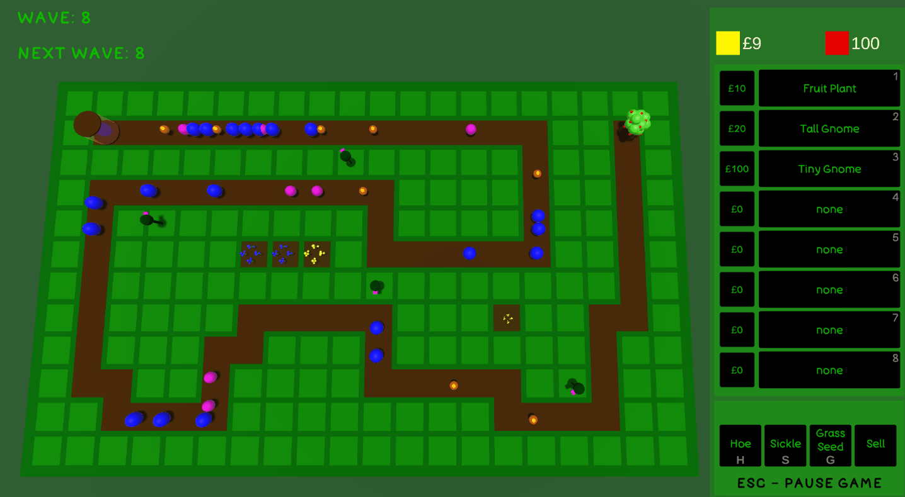

<!-- Project Information -->

  <h1>Grow Your Defence</h1>
  <h3>🎮Game Description:</h3>
  <h4>My first tower defence game made for a game jam, hosted by 'Airship Images'. The aim of the game is to grow and sell plants to purchase gnomes that defend your garden.</h4>
  <h3>⭐Project Summary:</h3>
  <ul>
    <li>Team: Solo
    <li>Theme: Growth
    <li>Duration: 1 month
    <li>Language: C#
    <li>Engine: Unity (Version: 2020.3.31f1)
  </ul>

<!-- Project Image/Gif -->

  

